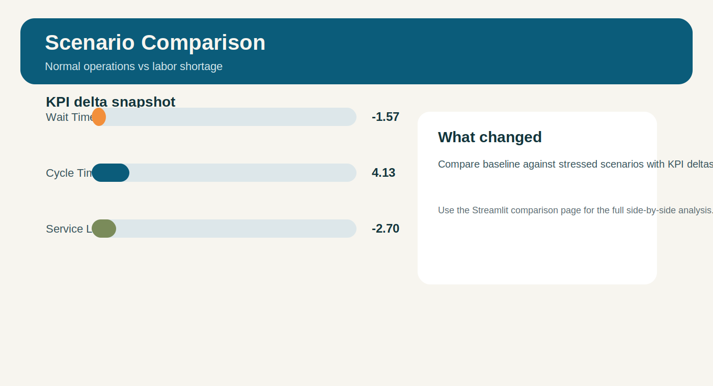

# HVDC OpsBrain

HVDC OpsBrain is a production-style warehouse digital twin and decision intelligence platform that combines synthetic operations data, forecasting, optimization, simulation, analytics, and a Streamlit control tower for inbound and internal warehouse flow decisions.

## Why It Stands Out

- blends forecasting, optimization, simulation, and recommendations in one decision workflow
- includes scenario comparison and persisted run history instead of a single static dashboard
- ships with a polished multi-page Streamlit app, tests, docs, Docker support, and export scripts
- is framed around realistic warehouse management questions rather than generic ML demos

## Problem Statement

Warehouse leaders need to answer operational "what-if" questions before service levels erode:

- What happens if inbound volume rises next week?
- What if dock doors become unavailable?
- What if labor is short on a critical shift?
- Where will receiving, staging, putaway, or replenishment bottlenecks appear?
- Which staffing and dock decisions minimize delay, overtime, and congestion?

## Solution Overview

This project is designed as a modular decision-support platform with independently testable engines:

1. Synthetic data generator for realistic warehouse entities and events.
2. Forecasting models for inbound volume, hourly workload, labor demand, and congestion risk.
3. OR-Tools optimization for dock assignments, appointment plans, and labor allocation.
4. SimPy digital twin to evaluate flow, queues, resource contention, and scenario impact.
5. Analytics and recommendation layers that convert outputs into business actions.
6. Streamlit dashboard for executive monitoring and interactive scenario analysis.

## Business Case

Warehouse managers and CI teams often see problems only after queues form, labor costs spike, or service commitments are missed. HVDC OpsBrain is built to shift those decisions earlier by forecasting workload, stress-testing scenarios, and recommending concrete actions before the operation tips into congestion.

## Architecture

```text
                 +----------------------+
                 |  Scenario Config     |
                 +----------+-----------+
                            |
                            v
 +----------------+   +-----+------+   +---------------------+
 | Synthetic Data |-->| Forecasting |-->| Optimization Engine |
 +----------------+   +-----+------+   +----------+----------+
                            |                        |
                            v                        v
                     +------+------------------------+------+
                     | SimPy Digital Twin + KPI Analytics   |
                     +------------------+-------------------+
                                        |
                                        v
                            +-----------+------------+
                            | Recommendations + UI   |
                            +------------------------+

app/
  streamlit_app.py
  pages/
src/
  analytics/
  config/
  data/
  database/
  features/
  forecasting/
  optimization/
  recommendations/
  simulation/
  utils/
tests/
scripts/
outputs/
```

For a deeper system view, see [docs/architecture.md](c:\Users\Osayamwen\Desktop\warehouse_twin\docs\architecture.md).

## Modeling Approach

- Synthetic generation uses scenario-aware stochastic rules with seedable randomness.
- Forecasting blends a baseline seasonal heuristic with feature-based machine learning.
- Optimization minimizes delay, overtime, congestion risk, and service breaches under dock and labor constraints.
- Simulation models arrivals, unloading, staging, putaway, replenishment, and shared resource contention.
- Recommendations map KPI exceptions and scenario deltas into specific operational actions.

## Quick Start

```bash
python -m pip install -r requirements.txt
python scripts/generate_demo_data.py
python scripts/run_mvp.py
python scripts/build_demo_report.py
python scripts/generate_showcase_assets.py
streamlit run app/streamlit_app.py
```

## Tech Stack

- Python 3.11+
- pandas, numpy, scikit-learn
- OR-Tools
- SimPy
- Streamlit
- Plotly
- pydantic
- SQLAlchemy + SQLite
- pytest

## Screenshots

Add screenshots from the Streamlit app here after launching the local demo:

- Executive Overview hero and KPI cockpit
- Forecasting page with workload outlook
- Scenario Lab showing queue impact under labor or dock stress
- Recommendations page with action table

## Showcase

Executive snapshot:



Scenario comparison snapshot:



## Portfolio Summary

HVDC OpsBrain answers the kinds of questions warehouse leaders care about in practice: how inbound surges, labor shortages, fragile mix changes, and dock outages affect wait time, throughput, congestion, and service level. The platform combines scenario-aware synthetic operations data, forecast modeling, dock and labor planning, SimPy-based digital twin analysis, bottleneck analytics, recommendation generation, and a polished Streamlit interface for decision support.

## Current Status

The current MVP includes:

- config-driven synthetic data generation for inbound trucks, docks, labor, tasks, equipment, zones, and KPI history
- CSV and SQLite persistence
- daily inbound forecasting, hourly workload forecasting, labor demand estimation, and congestion scoring
- dock assignment optimization plus shift-level labor plan recommendations
- warehouse flow digital twin with scenario-aware queue and throughput KPIs
- bottleneck detection and recommendation generation
- multi-page Streamlit dashboard and scenario lab
- pytest coverage for the core modules

The code is structured so each engine remains independently testable and replaceable as the project grows.

## Documentation

- Architecture details: [docs/architecture.md](c:\Users\Osayamwen\Desktop\warehouse_twin\docs\architecture.md)
- Demo walkthrough: [docs/demo_walkthrough.md](c:\Users\Osayamwen\Desktop\warehouse_twin\docs\demo_walkthrough.md)
- Results snapshot: [docs/results_snapshot.md](c:\Users\Osayamwen\Desktop\warehouse_twin\docs\results_snapshot.md)

## Streamlit Pages

1. Executive Overview
2. Forecasting
3. Dock Optimization
4. Labor Planning
5. Simulation / Scenario Lab
6. Bottleneck Analysis
7. Recommendations
8. Data Explorer

## Scenario Controls

The scenario lab supports adjustments to:

- inbound volume
- available workers
- active docks
- fragile mix
- priority mix
- operating hours
- named operating scenarios such as peak season, labor shortage, dock outage, and inbound surge

## Assumptions

- The warehouse operates three shifts with inbound-heavy receiving and downstream putaway/replenishment.
- Dock doors have compatibility differences for standard, fragile, and temperature-sensitive loads.
- Labor is multi-skill but not perfectly interchangeable across stages.
- Historical data is synthetic but structured to resemble real operating patterns.

## Deliverables

- Reproducible local demo
- Config-driven scenarios
- Downloadable outputs
- Professional dashboard and documentation
- Tests for core logic

## Results Produced

Running `python scripts/run_mvp.py` exports:

- forecast outputs and evaluation metrics
- dock assignment and labor planning recommendations
- simulation event logs and KPI summaries
- bottleneck tables
- action recommendations

These files are written into `outputs/reports/<scenario>/`.

Running `python scripts/build_demo_report.py` also creates a concise markdown report in the same folder for demo handoff or portfolio review.

Running `python scripts/generate_showcase_assets.py` creates lightweight SVG showcase assets under `docs/assets/` for README presentation.

## Future Improvements

- Add external demand calendars and holiday integrations
- Extend the digital twin to outbound picking and shipping
- Add probabilistic forecast intervals and more advanced scheduling heuristics
- Support multi-site network planning
