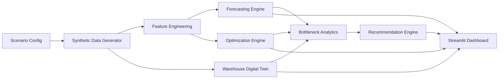

# HVDC OpsBrain Architecture

The MVP is built around a modular pipeline:

1. `src.data.generator` creates scenario-aware synthetic warehouse tables.
2. `src.forecasting.engine` predicts daily volume, hourly workload, labor demand, and congestion risk.
3. `src.optimization.dock_scheduler` recommends dock assignments and labor plans.
4. `src.simulation.digital_twin` simulates inbound-to-putaway flow with shared resources.
5. `src.analytics.kpis` identifies bottlenecks across forecast, simulation, and labor plans.
6. `src.recommendations.engine` converts signals into business actions.
7. `app/` renders the decision dashboard in Streamlit.

This structure keeps each module testable in isolation while still supporting an end-to-end demo pipeline.

## System Flow

## Module Responsibilities

- `src/config`: scenario and application settings.
- `src/data`: synthetic entity and event generation, plus persistence pipeline.
- `src/features`: derived features for forecasting and workload shaping.
- `src/forecasting`: daily volume, hourly workload, labor demand, and congestion risk.
- `src/optimization`: dock scheduling and labor planning.
- `src/simulation`: SimPy-based warehouse flow model with fallback heuristics for lighter environments.
- `src/analytics`: KPI and bottleneck synthesis across engines.
- `src/recommendations`: business-facing action generation.
- `app`: Streamlit dashboard and module pages.
- `scripts`: reproducible local demo and export workflows.

## Persistence Pattern

- Synthetic tables are saved to CSV under `outputs/data/<scenario>/`.
- Core tables are also written to local SQLite via `src/database/sqlite_store.py`.
- Pipeline outputs are exported to `outputs/reports/<scenario>/`.
